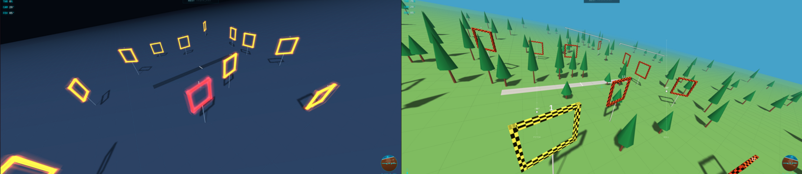

# FPV Sim

A browser-based free FPV (first-person view) drone racing simulator in **acro/balance mode**. No build, no framework, any device, any gamepad — the whole simulator is one HTML file (plus a small manifest/service-worker/icon set that make it installable and playable offline, see below).

## Running it

Open [index.html](index.html) directly in a browser — nothing to install, nothing to build.

It also installs as an app (see [Installing](#installing--offline-use)) for a full-screen, offline-capable experience on both desktop and mobile.

## Controls

### Keyboard

| Action | Keys |
|---|---|
| Throttle up / down | `SPACE` / `SHIFT` |
| Pitch (forward/back) | `W` / `S` |
| Roll (left/right) | `A` / `D` |
| Yaw (rotate) | `Q` / `E` |
| Camera tilt | `↑` / `↓` |
| Field of view (FOV) | `←` / `→` |
| Reset run / world | `R` |
| Open settings | `M` or the ⚙ button |
| Close settings | `ESC` |
| Show keybind hint again | `?` |

### Gamepad

Plug in a controller and it's used automatically (Mode 2 layout by default: left stick = throttle/yaw, right stick = pitch/roll). A connected controller takes over as soon as you actually move a stick — leaving one plugged in but idle doesn't disable the keyboard, and any keypress hands control back. Use the **CONTROLLER** settings tab to remap axes if the defaults don't match your stick, including an auto-detect wizard (see below).

### Touch (phone / tablet)

Two on-screen sticks appear automatically on touch devices, laid out like Mode 2:

- **Left stick** — throttle (vertical) and yaw (horizontal). The throttle axis is **self-latching**: it stays where you leave it, like a real throttle stick. Yaw springs back to centre.
- **Right stick** — pitch and roll, both self-centering.

Extra **MODE** and **↺** buttons appear in the HUD button row for the flight-mode and reset actions that would otherwise need a keyboard. Set **Virtual sticks** in **CONTROLLER** settings to `ALWAYS ON` / `OFF` to override the automatic detection.

### Flight modes

Click the mode badge (bottom-left of the HUD, or bottom-centre with the touch sticks up) to switch between:

- **ACRO** — pure rate control. Sticks command rotation speed; the drone holds whatever angle you leave it at. No self-leveling.
- **BALANCED** — angle/self-leveling mode. Sticks command a target bank/pitch angle and the drone levels itself out when the stick is centered. Easier for beginners.

## HUD

- **Telemetry** (top-left): speed, altitude, throttle %, camera tilt, FOV.
- **Gate + lap counter** (top-center): current gate / total gates, and the current lap number.
- **Lap timer** (below the gate counter) — see [Lap timing](#lap-timing).
- **Attitude Indicator (ADI)** — the circular artificial-horizon dial (bottom-right) showing roll and pitch.
- **FPV attitude overlay** — a horizon bar across the center of the view (tilts with roll, slides with pitch) plus two side gauges for pitch and roll with a numeric readout. Toggle it on/off in **GENERAL** settings.
- **Throttle bar** (left edge; hidden when the touch sticks are up, since the left stick shows it).
- **Crash banner** — names what you hit and shows a countdown bar until the respawn.
- 🔊 mute engine sound, ⤢ toggle fullscreen, ⚙ open settings.

The keybind hint along the bottom fades out after ~15 seconds of flight. Press `?` or open settings to bring it back.

## Flying the circuit

Fly through the numbered gates in order — passing through the center of the current gate advances you to the next one. Clipping a gate's frame/pole, or hitting the ground hard, triggers a crash.

After a crash you respawn **just short of the gate you were heading for, facing it**, so a late mistake costs you a few seconds rather than the whole run — your gate progress and lap clock are preserved. Press `R` for a full restart (and to reshuffle the gate layout, unless disabled — see below).

## Lap timing

A lap runs from crossing gate 1 to crossing gate 1 again.

- The **running lap time** starts on your first gate and keeps counting through crashes — the respawn delay is the penalty.
- Each gate posts a **split**, and the `+/-` figure next to `BEST` shows how far ahead (green) or behind (red) that split is versus your best lap.
- Completing a lap flashes the time and compares it to your **best lap**, which persists in `localStorage`.
- A lap in which you crashed is **dirty**: the clock turns red and that lap cannot set a new best, though it still displays.

Clear the stored best from **GENERAL → LAP TIMING**.

## Settings (⚙ / `M`)

Close the panel with **▶ FLY**, `ESC`, `M`, or a click outside it.

Most sections have a small **ⓘ** button next to their title. Click it for an in-app explanation of what that section does; the button fills in while its note is open. Notes are collapsed by default so the controls all fit on one screen, and whichever ones you leave open are remembered between sessions. Everything they say is also covered — usually in more detail — in the sections below.

The two **ADVANCED SETTINGS** blocks (in CONTROLLER and PHYSICS) collapse the same way and likewise remember their state.

### CONTROLLER

**Quick setup — AUTO-DETECT ALL**: runs a wizard that steps through each channel and samples ~2.5s of stick movement to infer its axis index and sign (inverted or not) automatically. Each channel also has its own individual **DETECT** button in the advanced table below if you only need to redo one.

**Camera & view** (works without a gamepad, including on mobile):

| Setting | What it controls | Range | Default |
|---|---|---|---|
| Camera tilt | Cockpit view angle — how far the camera looks down/up relative to the drone's nose | 0–90° | 20° |
| Field of view | Camera FOV — wider feels more "fisheye" and fast, narrower feels more zoomed-in | 50–120° | 85° |

Both are also bound to `↑`/`↓` (tilt) and `←`/`→` (FOV) while flying, and both persist between sessions.

**Virtual sticks** — `AUTO` (touch devices only, the default), `ALWAYS ON`, or `OFF`. See [Touch](#touch-phone--tablet).

**Manual / advanced settings** — expand for the raw axis mapping:

| Channel | Controls | Default stick |
|---|---|---|
| Throttle | Vertical thrust | Left stick ↑↓ |
| Yaw | Rotate around the vertical axis | Left stick ←→ |
| Roll | Tilt sideways | Right stick ←→ |
| Pitch | Tilt forward/back | Right stick ↑↓ |

Each channel row lets you pick the physical **axis index**, an **invert** checkbox, and shows a **live value bar** fed by the raw gamepad signal, plus its own DETECT button.

- **Deadzone (deadband)** — ignores stick input below this threshold, so a controller that doesn't rest exactly at center (drift) doesn't produce phantom input. 0–25%, default 5%.

### PHYSICS

Four presets tune how the drone feels:

| Preset | Feel |
|---|---|
| **Beginner** | Smooth, stable flight, moderate thrust, slow turns |
| **Racing** | The classic agile-but-controllable balance |
| **Freestyle** | Maximum angular agility for flips and acro tricks |
| **Cinematic** | Slow, smooth movements for relaxed camera shots |

The simulator actually starts on a tuned **default** configuration that doesn't exactly match any preset (punchy but controllable) — it's what you get on first load, before picking a preset or touching a slider.

**Advanced settings (sliders)** — fine-tune any parameter individually. Changes apply live and **autosave** about half a second after you stop dragging (any manual tweak un-marks the active preset); the **SAVE** button is an explicit "commit now" that stamps the time in the footer:

| Slider | What it controls | Range | Default |
|---|---|---|---|
| Idle (motors armed at 0%) | Minimum thrust the motors produce even with the stick at zero — armed motors never truly cut out mid-flight | 0–30% | 1% |
| Power (TWR) | Engine power vs. weight (thrust-to-weight ratio) — higher means more punch and faster climbs | ×1.7–×10 | ×5.3 |
| Hover stick % | Where on the throttle stick's travel the drone hovers in place, independent of TWR | 30–70% | 50% |
| Linear drag | Air resistance opposing velocity — higher feels like flying underwater (kills momentum fast), lower feels floaty/weightless | 0.01–0.60 | 0.14 |
| Roll/pitch rates | Maximum rotation speed at full roll/pitch stick deflection | 100–1200°/s | 620°/s |
| Yaw rate | Maximum rotation speed at full yaw stick deflection | 50–720°/s | 400°/s |
| Response (snap) | How quickly rotation speed reacts to stick input — higher feels snappier and more direct | 5–50 | 41 |
| Angular drag | Braking applied to rotation — higher stops spins/flips faster | 0.70–1.00 | 0.90 |

A live **analysis panel** below the sliders derives human-readable stats from the current configuration — thrust-to-weight ratio, max net acceleration, approximate terminal velocity, and a qualitative note on how the current drag/thrust combo will feel.

### GENERAL

- **Visual theme** — `DAY` or `NIGHT` (neon-lit gates on a dark track). Each theme remembers its own "show trees" preference.
- **Graphics quality** — `LOW` / `MEDIUM` / `HIGH`, driving render resolution, antialiasing and the shadow map together. Defaults to MEDIUM on touch devices and HIGH on desktop. Resolution and shadows switch instantly; antialiasing is fixed when the WebGL context is created, so changing that part needs a page reload (the UI says so when it applies).
- **Lap timing** — shows the stored best lap and a **CLEAR BEST** button.
- **Randomize world on every reset** — when on, pressing `R` reshuffles gates and trees along with your position. Turn it off to keep the same layout (R only resets your position); reshuffle manually with the **RANDOMIZE NOW** button that appears. Default: on.
- **Show attitude HUD (pitch/roll)** — toggles the FPV horizon bar and side gauges described above. Default: on.
- **Show trees** — draws the trees dotted around the map. Hidden trees never collide, whatever "Collide with trees" is set to. Default: on in DAY, off in NIGHT, and each theme remembers your choice separately.
- **Collide with gates** — when on, clipping a gate's frame or support pole triggers a crash instead of only counting a pass when you go through the center. Turn off to fly through gate frames freely. Default: on.
- **Collide with trees** — when on, touching a tree's trunk or foliage triggers a crash. Turn off to fly through the scenery — handy for practicing lines without being punished for clipping trees. Default: on.

### Footer

- **↺ RESET** returns the physics sliders to the tuned default. It asks once — the button changes to `↺ CONFIRM?` for a few seconds, and only a second click actually resets.
- **💾 SAVE** commits immediately and stamps the time. It's optional: physics autosaves on its own, and every other setting writes through the moment you change it.
- **▶ FLY** closes the panel.

All settings persist automatically in your browser (`localStorage`) — no account or save file needed. Nothing leaves your machine.

## Installing / offline use

The site is a PWA (Progressive Web App): a **service worker** ([sw.js](sw.js)) caches the page and everything it needs — including the three.js library, which otherwise comes from a CDN — the first time you visit. After that, reloading or reopening the site works **with no internet connection at all**, whether or not you've formally "installed" it.

Installing just adds a proper icon and drops the browser chrome (address bar, tabs) for a full-screen, app-like window:

| Platform | How |
|---|---|
| **Android** (Chrome / Edge / Samsung Internet) | Tap **⋮ → Install app** (or the install banner Chrome shows automatically). Launches full-screen, locked to landscape. |
| **Desktop** (Chrome / Edge, Windows / macOS / Linux / ChromeOS) | Click the **install icon** in the address bar (or **⋮ → Install FPV Sim…**). Opens in its own app window. |
| **iOS / iPadOS** (Safari) | **Share → Add to Home Screen**. This is Apple's own mechanism — Safari doesn't show an automatic install prompt like Chrome does, so it's a manual step every time on a new device. |
| **Firefox desktop** | No install button (Mozilla dropped desktop PWA install UI), but the site still works fully — including offline — in a regular tab. |

You don't need to install it for the offline behavior — just visiting the page once while online is enough for the service worker to take over. Installing only changes how it's launched afterward.

**Updating**: the service worker serves the cached copy instantly and re-fetches the latest version in the background for *next* time (a "stale-while-revalidate" cache), so you'll always be at most one visit behind the live site — no manual refresh trick needed.

## Notes

The simulation runs on a **fixed 1/120s timestep** with an accumulator, so flight feel and collision accuracy don't change with your frame rate — a slow machine renders fewer frames rather than running the physics in slow motion or letting a fast drone tunnel through a gate bar.

`three.js` is loaded from a CDN on first visit and cached by the service worker from then on (see [Installing / offline use](#installing--offline-use)). If the very first load fails to reach the CDN — no cache yet and no connection — the page says so instead of showing a black screen.
